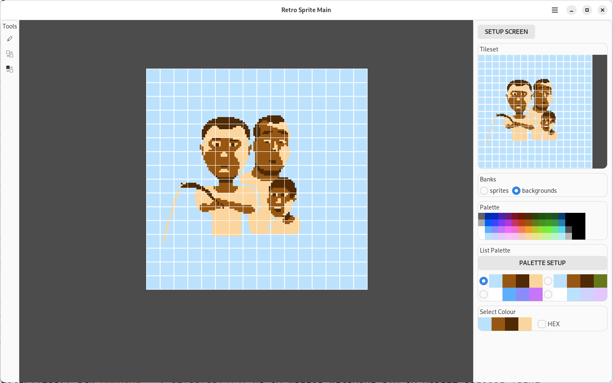

# Retro Sprite Editor
Draw your sprites and backgrounds with this program specially designed for retro consoles.
### [Consider donating to help this software's development][donate]

## Screenshot

## Download
[][flathub]

## Features
* Save as NES format
* Pencil for Pixel Art
* Software is FOSS
* Button for Moving Tiles on the Canvas
* Button for Swapping Tiles

## NES
* 4 palettes to choose from, which can be customized.
* Two memory banks for sprites and backgrounds.
* Showing the color index numbers.
* Multi screens for saving an assembler code.
* Two Sprite Modes: 8x8 and 8x16.

[flathub]: https://flathub.org/apps/io.github.xverizex.RetroSpriteEditor
[donate]: https://www.donationalerts.com/r/xverizex
